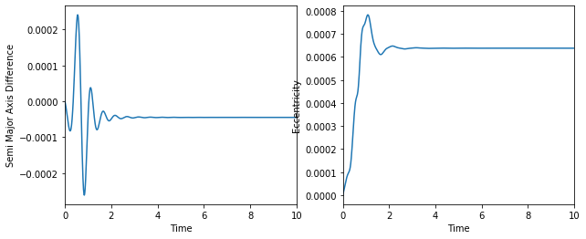

# Of Grazing Incidence

Doing some research of perturbation events of "grazing" stars that pass by a solar system. I thought of this after reading an article on Scholz's Star.

Start with a simple two-body system, the an Earth mass body in a perfectly circular orbit with radius of 1 AU around a solar mass star. Then add our perturber, a smaller star of 0.15 solar masses. Scholz's star has a mass of 0.095 solar masses, but increasing the mass increases the perturbative effect. Then randomly sample a tangent line to a sphere of radius 10 AU. The perturber thus has a point of closest approach at 10 AU. Then give the perturber a velocity of 83.1 km/s, the velocity of Scholz's Star, and make sure it's flying towards the system (not away). Finally, let it fly by the system and measure the final semi major axis and final eccentricity at the end.

See the Jupyter notebook for the data analysis!

Results from a single run:

There's an interesting ring down effect in the semi major axis, reminds me of a gravitational wave event. Eccentricity invariably increases, but there's a "pullback" from when I'm assuming the perturbing body passes its point of closest approach.

Final settled values from a thousand runs:

Also very interesting results. We get a symmetric distribution for the semi major axis, and quite a long distribution for the eccentricity.

There's a lot more that could be studied here! One could try to see the effects on actual Solar System bodies, modulate the perturber mass, velocity, and point of closest approach. The dynamical stability of the Solar System and other exoplanetary systems is definitely an area of active research. One paper I read in particular was very insightful: 

Batygin, Konstantin, and Gregory Laughlin. “On the Dynamical Stability of the Solar System.” The Astrophysical Journal, vol. 683, no. 2, 2008, pp. 1207–1216., doi:10.1086/589232. 

I also think there must be some kind of analytical solution for a two body system plus a perturber. This technically makes it a three-body problem, which is notoriously unsolvable except in very special cases. I'm sure there's some relationships that may be determined from an analytical perspective.
